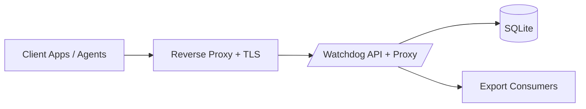
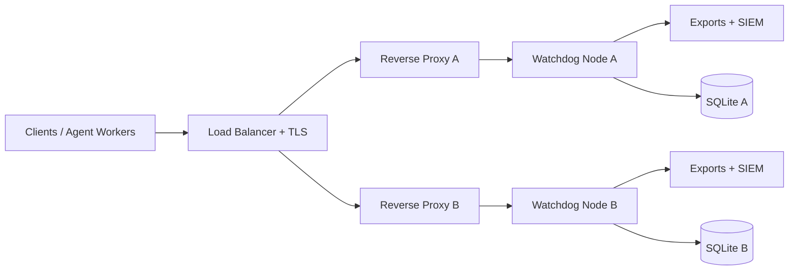

# Watchdog Enterprise Deployment Architecture

This page defines recommended deployment patterns for Watchdog, including TLS boundaries, auth controls, and retention workflows.

## 1. Architecture goals

- Keep Watchdog API and proxy traffic behind explicit trust boundaries.
- Terminate TLS before traffic reaches Watchdog.
- Enforce independent auth controls for `/api/*` and `/proxy/*`.
- Keep telemetry retention explicit and auditable.

## 2. Single-node pattern

Use this when one Watchdog instance is sufficient for your expected traffic volume.



Boundary guidance:
- TLS termination at reverse proxy.
- Reverse proxy restricts inbound CIDRs and allowed methods.
- Watchdog runs with `WDG_API_AUTH_MODE=token` and `WDG_PROXY_AUTHZ_MODE=token`.

## 3. Scaled pattern

Use this when running multiple Watchdog instances behind a load balancer.



Scaling guidance:
- Treat each node as an isolated telemetry domain.
- Use external aggregation from `/api/export` for centralized analytics.
- Keep token/material rotation coordinated across nodes.

## 4. TLS and auth boundary reference

Recommended flow:
1. Client establishes TLS with reverse proxy.
2. Reverse proxy forwards to Watchdog over private network.
3. `/api/*` requests include `X-Watchdog-Token` (or bearer token).
4. `/proxy/*` requests include `X-Watchdog-Proxy-Token` (or bearer token).

Core controls:
- `WDG_API_AUTH_MODE=token`
- `WDG_PROXY_AUTHZ_MODE=token`
- `WDG_REDACTION_MODE=basic`
- `WDG_RATE_LIMIT_MODE=basic`
- `WDG_RATE_LIMIT_MAX_BUCKETS` and `WDG_RATE_LIMIT_BUCKET_TTL_SECS` for limiter memory bounds

## 5. Retention and lifecycle pattern

- Daily dry-run prune preview.
- Operator approval window.
- Non-dry-run prune execution.
- Audit review via `/api/audit-events`.
- Export snapshot before destructive retention events.

Example retention commands:

```bash
curl -s -X POST http://127.0.0.1:7700/api/admin/prune \
  -H 'Content-Type: application/json' \
  -H 'X-Watchdog-Token: replace-with-long-random-token' \
  -d '{"before_ms": 1700000000000, "dry_run": true}'

curl -s -X POST http://127.0.0.1:7700/api/admin/prune \
  -H 'Content-Type: application/json' \
  -H 'X-Watchdog-Token: replace-with-long-random-token' \
  -d '{"before_ms": 1700000000000, "dry_run": false}'

curl -s 'http://127.0.0.1:7700/api/audit-events' \
  -H 'X-Watchdog-Token: replace-with-long-random-token'
```

## 6. Command quick-reference

Startup baseline:

```bash
export WDG_API_AUTH_MODE=token
export WDG_API_AUTH_TOKEN='replace-with-long-random-token'
export WDG_PROXY_AUTHZ_MODE=token
export WDG_PROXY_AUTHZ_TOKEN='replace-with-long-random-proxy-token'
export WDG_REDACTION_MODE=basic
export WDG_RATE_LIMIT_MODE=basic
export WDG_RATE_LIMIT_MAX_BUCKETS=5000
export WDG_RATE_LIMIT_BUCKET_TTL_SECS=600
export KUJO_BIN=${KUJO_BIN:-kujo}
"$KUJO_BIN" run --interpreter dashboard_server.kujo
```

Health and diagnostics:

```bash
curl -s http://127.0.0.1:7700/healthz
curl -s http://127.0.0.1:7700/readyz
curl -s http://127.0.0.1:7700/api/version -H 'X-Watchdog-Token: replace-with-long-random-token'
curl -s http://127.0.0.1:7700/api/admin/diagnostics -H 'X-Watchdog-Token: replace-with-long-random-token'
```
